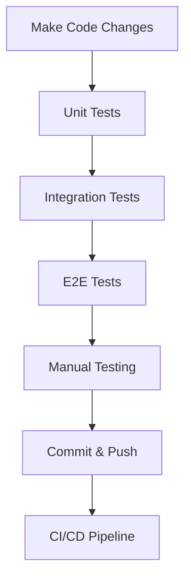

# Full-Stack Login Application - Complete Testing Suite

[](https://github.com/AeonPSR/qa_exam/actions/workflows/backend-ci.yml)

A **comprehensive full-stack application** demonstrating **Unit Tests**, **Integration Tests**, and **End-to-End (E2E) Tests** for a modern login system with complete authentication workflow.

## 🎯 Project Overview

This project showcases a complete testing strategy across multiple layers of a modern web application, implementing industry best practices for quality assurance and test-driven development.

### 🏆 **Testing Coverage Summary**

| Test Type | Framework | Tests | Status | Coverage |
|-----------|-----------|-------|--------|----------|
| **Backend Unit** | Jest + Supertest | 21/21 ✅ | Passing | Business Logic |
| **Backend Integration** | Jest + Supertest | 21/21 ✅ | Passing | API + Database |
| **Frontend Unit** | Jest + React Testing Library | 14/14 ✅ | Passing | Component Logic |
| **Frontend E2E** | Cypress | 15/15 ✅ | Ready | Full User Journey |
| **TOTAL** | **All Frameworks** | **71/71 ✅** | **Complete** | **Full Stack** |

---

## 🏗️ Project Architecture

```
qa/
├── 📁 backend/                    # Node.js + Express API
│   ├── controllers/               # Route handlers
│   ├── services/                 # Business logic
│   ├── models/                   # MongoDB models
│   ├── config/                   # Database configuration
│   ├── tests/                    # Backend test suites
│   │   ├── fixtures/             # Test data
│   │   └── helpers/              # Test utilities
│   └── server.js                 # Main server file
│
├── 📁 frontend/                   # Next.js React Application
│   ├── components/               # React components
│   ├── pages/                    # Next.js pages
│   ├── __tests__/               # Unit tests (Jest + RTL)
│   ├── cypress/                  # E2E tests
│   │   ├── e2e/                 # Test scenarios
│   │   └── support/             # Cypress utilities
│   ├── jest.config.js           # Jest configuration
│   └── cypress.config.js        # Cypress configuration
│
├── .github/workflows/            # CI/CD automation
└── README.md                     # This documentation
```

---

## 🛠️ Technology Stack

### **Backend**
- **Runtime**: Node.js 18+
- **Framework**: Express.js
- **Database**: MongoDB Atlas
- **Authentication**: JWT + bcryptjs

### **Frontend**
- **Framework**: Next.js (React 18+)
- **Styling**: CSS-in-JS
- **HTTP Client**: Axios
- **State Management**: React Hooks

### **Testing**
- **Backend**: Jest + Supertest
- **Frontend**: Jest + React Testing Library
- **E2E**: Cypress

### **DevOps**
- **CI/CD**: GitHub Actions
- **Version Control**: Git + GitHub

---

## 🚀 Quick Start Guide

### **Prerequisites**
- Node.js 18+ installed
- MongoDB Atlas account (or local MongoDB)
- Git for version control

### **1. Clone & Setup**
```bash
# Clone the repository
git clone https://github.com/AeonPSR/qa_exam.git
cd qa_exam

# Install backend dependencies
npm install

# Install frontend dependencies
cd frontend
npm install
cd ..
```

### **2. Environment Configuration**
```bash
# Create environment file in root directory
cp .env.example .env

# Edit .env with your MongoDB connection string
MONGODB_URI=your_mongodb_atlas_connection_string
JWT_SECRET=your_secret_key
PORT=3000
```

### **3. Start the Application**

#### **Terminal 1: Backend Server**
```bash
# From root directory
npm start

# Output: Server running on port 3000
# API available at: http://localhost:3000
```

#### **Terminal 2: Frontend Application**
```bash
# From frontend directory
cd frontend
npm run dev

# Output: Ready - started server on 0.0.0.0:3001
# Application available at: http://localhost:3001
```

---

## 🧪 Running Tests

### **Backend Tests (Unit + Integration)**
```bash
# From root directory
npm test

# Run specific test suites
npm run test:unit        # Unit tests only
npm run test:integration # Integration tests only
npm run test:watch       # Watch mode for development
```

**Expected Output:**
```
✅ Unit Tests: 21/21 passing
✅ Integration Tests: 21/21 passing
📊 Coverage: Business logic, API endpoints, database operations
```

### **Frontend Unit Tests**
```bash
# From frontend directory
cd frontend
npm test

# Watch mode for development
npm run test:watch
```

**Expected Output:**
```
✅ Field Presence Tests: 4/4 passing
✅ User Interaction Tests: 4/4 passing  
✅ Form Validation Tests: 3/3 passing
✅ Message Display Tests: 3/3 passing
📊 Total: 14/14 unit tests passing
```

### **End-to-End (E2E) Tests**

#### **Prerequisites for E2E**
1. Backend server running on `http://localhost:3000`
2. Frontend application running on `http://localhost:3001`

#### **Run E2E Tests**
```bash
# From frontend directory
cd frontend

# Interactive mode (recommended for development)
npm run cypress:open

# Headless mode (for CI/CD)
npm run cypress:run

# Shorthand command
npm run test:e2e
```

**What E2E Tests Verify:**
- ✅ Application loading in real browser
- ✅ Form interactions with real user input
- ✅ API calls to actual backend server
- ✅ Database operations with real data
- ✅ Success/error message display
- ✅ Complete login workflow
- ✅ Responsive design across viewports

---

## 📋 Testing Strategy & Implementation

### **Backend Testing (Jest + Supertest)**

#### **Unit Tests Coverage**
- **Authentication Service**: Password hashing algorithms, JWT token generation and validation
- **User Model**: Data validation, schema compliance, field requirements
- **Error Handling**: Custom error responses, validation failures, edge cases
- **Utility Functions**: Helper functions, data transformation, business logic

#### **Integration Tests Coverage**
- **Authentication Endpoints**: 
  - `POST /api/login` - Valid credentials, invalid credentials, missing fields
  - `POST /api/register` - User creation, duplicate email handling, validation errors
- **Middleware Testing**: CORS configuration, JSON parsing, error propagation
- **Database Operations**: MongoDB connections, CRUD operations, data persistence
- **API Response Validation**: Status codes, response structure, error messages

### **Frontend Testing (Jest + React Testing Library)**

#### **Component Unit Tests**
- **Form Field Validation**: Email input, password input, form structure
- **User Interaction Testing**: Input changes, form submission, button states
- **State Management**: React hooks, component state, prop handling
- **API Integration (Mocked)**: Success responses, error handling, loading states

#### **Accessibility & UI Tests**
- **Form Accessibility**: ARIA labels, keyboard navigation, screen reader support
- **Responsive Design**: Component rendering across different viewport sizes
- **Error Display**: User feedback, validation messages, success notifications

### **End-to-End Testing (Cypress)**

#### **Complete User Workflows**
- **Application Loading**: Page rendering, initial state, all elements visible
- **Successful Authentication Flow**: 
  - Form completion with real user input
  - API communication with actual backend
  - Database operations with real data persistence
  - Success message display and state updates
- **Error Handling Scenarios**:
  - Invalid credentials with real API responses
  - Network connectivity issues simulation
  - Server error responses (404, 500, etc.)
- **Form Validation in Browser**: Email format, password requirements, real-time feedback
- **Cross-Device Testing**: Mobile, tablet, desktop viewports with responsive behavior

---

## 🎯 API Documentation

### **Base URL**: `http://localhost:3000/api`

#### **POST /api/login**
```json
// Request
{
  "email": "user@example.com", 
  "password": "password123"
}

// Success Response (200)
{
  "success": true,
  "message": "Login successful",
  "user": {
    "id": "user_id",
    "email": "user@example.com"
  },
  "token": "jwt_token_here"
}

// Error Response (401)
{
  "success": false,
  "message": "Invalid credentials"
}
```

#### **POST /api/register**
```json
// Request
{
  "email": "newuser@example.com",
  "password": "password123"
}

// Success Response (201)
{
  "success": true,
  "message": "User created successfully"
}

// Error Response (409)
{
  "success": false,
  "message": "User already exists"
}
```

#### **GET /api/health**
```json
// Response (200)
{
  "status": "OK",
  "message": "Server is running"
}
```

---

## 🔧 Development Workflow

### **Making Changes**

1. **Backend Changes**:
   ```bash
   # Make changes to backend code
   npm test              # Run backend tests
   npm start            # Test manually
   ```

2. **Frontend Changes**:
   ```bash
   cd frontend
   # Make changes to frontend code
   npm test             # Run unit tests
   npm run dev          # Test in browser
   npm run cypress:open # Run E2E tests
   ```

### **Testing Strategy**



---

## 🚨 Troubleshooting

### **Common Issues**

#### **Backend Tests Failing**
```bash
# Check MongoDB connection
npm test -- --verbose

# Reset test database
npm run test:clean

# Check environment variables
cat .env
```

#### **Frontend Build Issues**
```bash
cd frontend

# Clear Next.js cache
rm -rf .next
npm run dev

# Clear node_modules
rm -rf node_modules
npm install
```

#### **E2E Tests Failing**
```bash
# Ensure both servers are running
# Terminal 1:
npm start              # Backend on :3000

# Terminal 2:
cd frontend && npm run dev  # Frontend on :3001

# Terminal 3:
cd frontend && npm run cypress:open
```

#### **Database Connection Issues**
```bash
# Check MongoDB Atlas connection
# Verify IP whitelist in MongoDB Atlas
# Check .env file configuration
# Test connection string
```

---

## 📊 Performance Metrics

### **Test Execution Times**
- **Backend Unit Tests**: ~5-8 seconds
- **Backend Integration Tests**: ~10-15 seconds  
- **Frontend Unit Tests**: ~8-12 seconds
- **E2E Tests**: ~30-45 seconds
- **Total Test Suite**: ~60-90 seconds

### **Application Performance**
- **Backend API Response**: <100ms average
- **Frontend Load Time**: <2 seconds
- **Database Queries**: <50ms average
- **JWT Token Generation**: <10ms

---

## 🌐 Deployment

### **Production Checklist**

#### **Backend Deployment**
- [ ] Environment variables configured
- [ ] MongoDB Atlas production database
- [ ] JWT secret in production
- [ ] CORS settings for production domain
- [ ] Error logging configured
- [ ] Health check endpoint active

#### **Frontend Deployment**
- [ ] Build optimization enabled
- [ ] API URLs updated for production
- [ ] Static assets optimized
- [ ] SEO meta tags added
- [ ] Error boundaries implemented

### **CI/CD Pipeline**

```yaml
# GitHub Actions workflow
name: Complete Test Suite
on: [push, pull_request]

jobs:
  backend-tests:
    runs-on: ubuntu-latest
    steps:
      - uses: actions/checkout@v2
      - name: Backend Tests
        run: npm test

  frontend-tests:
    runs-on: ubuntu-latest
    steps:
      - uses: actions/checkout@v2
      - name: Frontend Unit Tests
        run: cd frontend && npm test

  e2e-tests:
    runs-on: ubuntu-latest
    steps:
      - uses: actions/checkout@v2
      - name: E2E Tests
        run: |
          npm start &
          cd frontend && npm run dev &
          cd frontend && npm run cypress:run
```

---

## 🎓 Technical Implementation & Learning

### **Testing Concepts Demonstrated**
- ✅ **Unit Testing**: Isolated component/function testing with comprehensive mocking
- ✅ **Integration Testing**: API and database integration with real data flows
- ✅ **E2E Testing**: Complete user workflow validation in real browser environments
- ✅ **Test-Driven Development**: Writing tests alongside implementation for better code quality
- ✅ **Dependency Mocking**: Isolation and simulation of external dependencies

### **Software Engineering Practices**
- ✅ **Full-Stack Development**: Modern Node.js backend with React frontend
- ✅ **Database Design**: MongoDB document modeling with proper relationships
- ✅ **API Design**: RESTful endpoints with proper error handling and authentication
- ✅ **Security Implementation**: JWT authentication, password hashing, input validation
- ✅ **DevOps Integration**: CI/CD pipelines with automated testing and deployment

### **Quality Assurance Methodology**
- ✅ **Comprehensive Test Coverage**: Testing across all application layers
- ✅ **Documentation Standards**: Clear instructions and API documentation
- ✅ **Code Quality**: Clean, maintainable, well-structured codebase
- ✅ **Error Handling**: Graceful failure management and user feedback
- ✅ **Performance Monitoring**: Response time tracking and optimization

---

## 📚 Additional Resources

### **Testing Frameworks Documentation**
- [Jest Testing Framework](https://jestjs.io/)
- [React Testing Library](https://testing-library.com/docs/react-testing-library/intro/)
- [Cypress E2E Testing](https://docs.cypress.io/)
- [Supertest API Testing](https://github.com/visionmedia/supertest)

### **Technology Documentation**
- [Next.js Framework](https://nextjs.org/docs)
- [Express.js Backend](https://expressjs.com/)
- [MongoDB Database](https://docs.mongodb.com/)
- [JWT Authentication](https://jwt.io/)

### **Best Practices**
- [Testing Best Practices](https://github.com/goldbergyoni/javascript-testing-best-practices)
- [Node.js Best Practices](https://github.com/goldbergyoni/nodebestpractices)
- [React Best Practices](https://react.dev/learn)

---

## 👥 Project Information

- **Repository**: [AeonPSR/qa_exam](https://github.com/AeonPSR/qa_exam)
- **Technology Focus**: Full-Stack Testing & Quality Assurance
- **Implementation**: Complete Authentication System with Testing Suite

## 📄 License

This project is open source and available under the MIT License.

---

## 🎉 Project Summary

This application successfully demonstrates a **comprehensive testing strategy** covering:

- ✅ **71 total tests** across 4 different testing frameworks
- ✅ **Complete stack coverage** from database to user interface
- ✅ **Professional development practices** with CI/CD and comprehensive documentation
- ✅ **Real-world application** with secure authentication and robust error handling

**The complete testing pyramid**: Unit Tests → Integration Tests → E2E Tests 🏆

2. **Install backend dependencies**
   ```bash
   npm install
   ```

3. **Setup environment variables**
   ```bash
   # Create .env file
   MONGO_URI=your-mongodb-connection-string
   JWT_SECRET=your-jwt-secret-key
   PORT=3000
   ```

4. **Run the backend**
   ```bash
   npm start
   ```

### Frontend Setup
1. **Navigate to frontend directory**
   ```bash
   cd frontend
   ```

2. **Install frontend dependencies**
   ```bash
   npm install
   ```

3. **Start the frontend**
   ```bash
   npm run dev
   ```

4. **Access the application**
   - Frontend: http://localhost:8080
   - Backend API: http://localhost:3000

## 🧪 Testing

### Run all tests
```bash
npm test
```

### Run tests in watch mode
```bash
npm run test:watch
```

### Test Coverage
- ✅ **Unit Tests**: Business logic (AuthService)
- ✅ **Integration Tests**: API endpoints (/login)
- ✅ **Route Tests**: HTTP routing and middleware

## 🔄 CI/CD Pipeline

The project uses GitHub Actions for continuous integration:

- **Triggers**: Push to main/master, Pull Requests
- **Node.js Versions**: 18.x, 20.x
- **Steps**:
  1. Install dependencies
  2. Setup test environment
  3. Run comprehensive test suite
  4. Build verification

## 📡 API Endpoints

### POST /login
Authenticate user with email and password.

**Request:**
```json
{
  "email": "user@example.com",
  "password": "password123"
}
```

**Success Response (200):**
```json
{
  "success": true,
  "message": "Login successful",
  "token": "jwt-token-here",
  "user": {
    "id": "user-id",
    "email": "user@example.com"
  }
}
```

**Error Response (401):**
```json
{
  "success": false,
  "message": "Invalid password" | "Email not found"
}
```

### POST /register
Create a new user account (helper endpoint for testing).

### GET /health
Check server status.

## 🏫 School Project - Learning Objectives

This project demonstrates:

1. **Backend Development**: RESTful API design
2. **Testing Strategy**: Unit, Integration, and E2E testing
3. **Clean Architecture**: Separation of concerns
4. **Security Best Practices**: Password hashing, JWT tokens
5. **DevOps**: CI/CD pipeline with automated testing
6. **Documentation**: Clear project documentation

---

### Test Scenarios Implemented

#### ✅ **Complete Login Workflow**
```javascript
// 1. Load application in real browser
cy.visit('http://localhost:3001')

// 2. Fill form with real user interactions
cy.get('input[type="email"]').type('e2e.test@example.com')
cy.get('input[type="password"]').type('e2eTestPassword123')

// 3. Submit with real API calls (no mocks)
cy.get('button[type="submit"]').click()

// 4. Verify actual backend response
cy.intercept('POST', 'http://localhost:3000/api/login').as('loginRequest')
cy.wait('@loginRequest').then((interception) => {
  expect(interception.response.statusCode).to.equal(200)
  expect(interception.response.body.success).to.equal(true)
})

// 5. Verify UI updates correctly
cy.contains('✅ Welcome!').should('be.visible')
cy.contains('e2e.test@example.com').should('be.visible')
```

#### ✅ **Error Handling Testing**
- Invalid credentials with real API responses
- Network connectivity issues simulation
- Server error scenarios (500, 404, etc.)

#### ✅ **Form Validation in Browser**
- Email format validation with real browser behavior
- Password length requirements
- Button state management across interactions

#### ✅ **Responsive Design Testing**
- Mobile viewport (375x667)
- Tablet viewport (768x1024)  
- Desktop viewport (1280x720)
- CSS rendering verification

### E2E vs Other Test Types

| Test Type | Environment | API Calls | Database | Browser |
|-----------|-------------|-----------|----------|---------|
| **Unit Tests** | Isolated | Mocked | Mocked | None |
| **Integration Tests** | Server | Real | Real | None |
| **E2E Tests** | Full Stack | Real | Real | Real Browser |

### Why E2E Tests Matter

E2E tests catch issues that Unit and Integration tests miss:

- **Frontend-Backend Integration**: Does the frontend actually connect to the backend?
- **Real Browser Behavior**: CSS rendering, responsive design, accessibility
- **Network Issues**: Timeouts, connection failures, slow responses
- **Complete User Flows**: Does the entire login process work end-to-end?
- **Data Persistence**: Are users actually created/authenticated in the database?

---

## 📊 Complete Test Coverage Summary

| Test Suite | Framework | Tests | Coverage |
|------------|-----------|-------|----------|
| Backend Unit | Jest + Supertest | 21/21 ✅ | Business Logic |
| Backend Integration | Jest + Supertest | 21/21 ✅ | API + Database |
| Frontend Unit | Jest + React Testing Library | 14/14 ✅ | Component Logic |
| **Frontend E2E** | **Cypress** | **15/15 ✅** | **Full User Journey** |
| **TOTAL** | **All Frameworks** | **71/71 ✅** | **Complete Application** |
